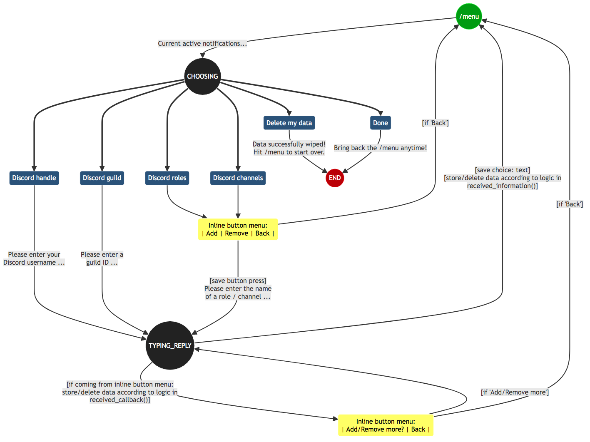

# JediSwap Alert Bot

[](https://www.python.org/downloads/release/python-390/)


A Telegram bot sending out a real time notification each time your handle is mentioned on the JediSwap Discord server. To use, start a conversation with [@JediSwapAlertBot](https://t.me/JediSwapAlertBot) on Telegram. This will bring up the bot menu, where you can set up your Discord handle. After entering it and verifying via Discord, the bot will forward any message mentioning your Discord handle or any of your roles to your Telegram. Notifications can be deactivated for any role or channel using the bot menu.

## Running the bot on your Discord server

- Clone this repository.
- [Get a Discord bot token and create an application](https://www.writebots.com/discord-bot-token/) at the Discord developer portal.
- At the portal, set the bot up with the permission to view channels and add [server members intent and message content intent](https://discordpy.readthedocs.io/en/stable/intents.html#member-intent).
- [Get a Telegram bot token.](https://riptutorial.com/telegram-bot/example/25075/create-a-bot-with-the-botfather)
- Rename `sample.env` to `.env` and enter the following information to the file without any spaces or quotes (1 exception):
    * `DISCORD_TOKEN=`your Discord bot token
    * `TELEGRAM_BOT_TOKEN=`your Telegram bot token
    * `OAUTH_DISCORD_CLIENT_ID=`your Discord application ID
    * `OAUTH_DISCORD_CLIENT_SECRET=`your Discord client secret
    * `OAUTH_REDIRECT_URI=`see 'Discord Authentication' below
    * `DEFAULT_GUILD=`your Discord [server ID](https://support.discord.com/hc/en-us/articles/206346498-Where-can-I-find-my-User-Server-Message-ID-)
    * `ALLOWED_CHANNEL_CATEGORIES=`"[channel ID,channel ID,channel ID, ...]" (enter the [category channel IDs](https://support.discord.com/hc/en-us/articles/206346498-Where-can-I-find-my-User-Server-Message-ID-) containing the channels the user is supposed to see in the bot's channels menu)
- Add the bot to your Discord server as shown [here](https://www.writebots.com/discord-bot-token/) or set up an [invite link](https://discordapi.com/permissions.html#66560).
- _Private channels:_ If the bot does not have a moderator role, he will need to be a member of any private channel the notifications are supposed to work in.
- Run `python main.py`.
- If run for longer periods of time, run `nohup python main.py` instead.

## Requirements & Installation

The bot requires python 3.9 and uses the packages listed in [requirements.txt](./requirements.txt). The best practice would be to install a virtual environment.

* Install & activate a virtual environment using either `venv`:

    ```
    python -m venv venv
    source venv/bin/activate    # `deactivate` to leave again
    ```

    or [anaconda](https://www.anaconda.com):

    ```
    conda create -n venv python=3.9
    conda activate venv         # `conda deactivate` to leave again
    ```

* Install dependencies:

    ```
    pip install -r requirements.txt
    ```

## Discord Authentication

This bot uses [Oauth2 authentication](https://discord.com/developers/docs/topics/oauth2), which requires a whitelisted redirect url to send back the verification info safely. Sending oauth data back to a Telegram bot instead of a website requires a workaround. To enable users to verify their Discord handle, you can set up an aws api gateway as described [here](https://stackoverflow.com/a/42457831). Add its url to the `.env` file under `OAUTH_REDIRECT_URI=`, and don't forget to also add it to the whitelist on the [Discord developer portal](https://discord.com/developers/) under Applications -> OAuth2 -> Redirects. These two entered urls need to match exactly.

## State Diagram


_Created with [mermaid](https://github.com/mermaid-js/mermaid-cli). [Template](https://docs.python-telegram-bot.org/en/stable/examples.conversationbot2.html) by the [python-telegram-bot](https://github.com/python-telegram-bot/python-telegram-bot) team._

## License

This project is licensed under the [MIT license](https://github.com/jediswaplabs/discord-alert-bot/blob/main/LICENSE) - see the [LICENSE](https://github.com/jediswaplabs/discord-alert-bot/blob/main/LICENSE) file for details.
